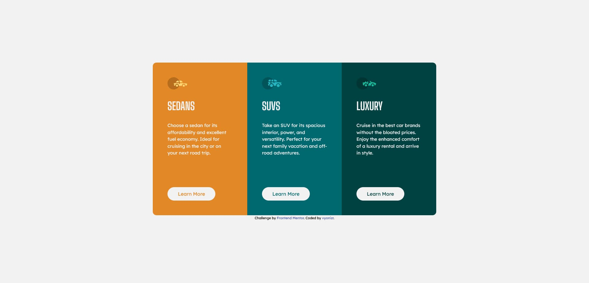

# Frontend Mentor - 3-column preview card component solution

This is a solution to the [3-column preview card component challenge on Frontend Mentor](https://www.frontendmentor.io/challenges/3column-preview-card-component-pH92eAR2-). Frontend Mentor challenges help you improve your coding skills by building realistic projects.

## Table of contents

- [Frontend Mentor - 3-column preview card component solution](#frontend-mentor---3-column-preview-card-component-solution)
  - [Table of contents](#table-of-contents)
  - [Overview](#overview)
    - [The challenge](#the-challenge)
    - [Screenshot](#screenshot)
    - [Links](#links)
  - [My process](#my-process)
    - [Built with](#built-with)
    - [What I learned](#what-i-learned)
    - [Useful resources](#useful-resources)
  - [Author](#author)

## Overview

### The challenge

Users should be able to:

- View the optimal layout depending on their device's screen size
- See hover states for interactive elements

### Screenshot

### Links

- [Solution URL](https://github.com/vyonizr/fm-3-column-preview-card-component)
- [Live Site URL](https://fm-3-column-preview-card.netlify.app)

## My process

### Built with

- Semantic HTML5 markup
- Mobile-first workflow
- [SolidJS](https://www.solidjs.com/) - UI library
- [Tailwind CSS](https://tailwindcss.com/) - For styles

### What I learned

From this challenge, I learned that Tailwind CSS cannot read custom classes for arbitrary values (e.g. custom color) in a dynamic component (e.g. rendering a loop). So the workaround is setting the `color` property as inline style or create a specific class. From Tailwind docs:

> Tailwind doesn’t include any sort of client-side runtime, so class names need to be statically extractable at build-time, and can’t depend on any sort of arbitrary dynamic values that change on the client. Use inline styles for these situations, or combine Tailwind with a CSS-in-JS library like Emotion if it makes sense for your project.

### Useful resources

- [Tailwind CSS Just-in-Time Mode](https://v2.tailwindcss.com/docs/just-in-time-mode) - This helped me understanding Tailwind caveats.

## Author

- Website - [vyonizr.com](https://vyonizr.com/)
- Frontend Mentor - [@vyonizr](https://www.frontendmentor.io/profile/vyonizr)
